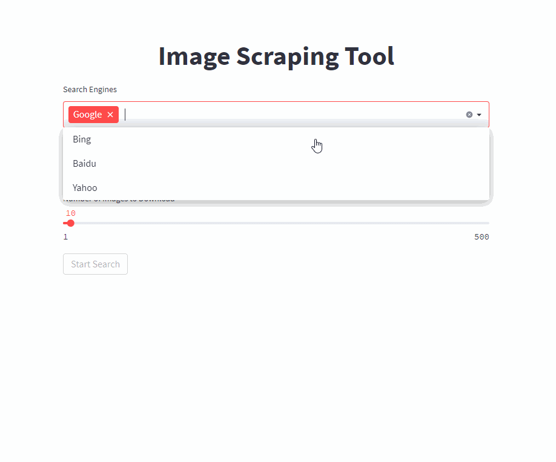

[][arxiv]
[][project page]

# Easy Image Scraping from Google, Bing, Yahoo and Baidu

Automatically scrape images with your query from the popular search engines

- Google
- Bing
- Baidu
- Yahoo (currently only low resolution)

using an easy-to-use Frontend or using scripts.



This code is part of a [paper][arxiv] ([citation](#citation)), also check
the [project page][project page] if you are interested in creation a dataset for instance segmentation.

## Usage

### Front End

Start the front end with a single command (adjust the `/PATH/TO/OUTPUT` to your desired output path)

```shell
docker run -it --rm --name easy_image_scraping --mount type=bind,source=/PATH/TO/OUTPUT,target=/usr/src/app/output -p 5000:5000 ghcr.io/a-nau/easy-image-scraping:latest
```

Enter your query and wait for the results to show in the `output` folder. The web applications also shows a preview of
downloaded images.

### Command Line

Start using the command line with

```shell
docker run -it --rm --name easy_image_scraping --mount type=bind,source=/PATH/TO/OUTPUT,target=/usr/src/app/output -p 5000:5000 ghcr.io/a-nau/easy-image-scraping:latest bash
```

#### Search for a keyword

If you just want to search for a single keywords adjust and run [`search_by_keyword.py`](src/tools/search_by_keyword.py)

#### Search for a list of keywords

- Write the list of search terms in the file `search_terms_eng.txt`.
- You can then use [Google Translate](https://translate.google.com/) to translate the whole file to new languages.
  Change the ending of the translated file to the respective language.
- Adjust [`config.py`](src/config.py) to define search engines for each language
- Run [`search_by_keywords_from_files`](src/tools/search_by_keywords_from_files.py)

## Installation (optional)

This is optional - you can also directly use our provided container.

### Docker

You can also build and run the image yourself using

```shell
docker build -t easy_image_scraping . && docker run -it --rm --name easy_image_scraping -p 5000:5000 --mount type=bind,source=/PATH/TO/OUTPUT,target=/usr/src/app/output easy_image_scraping
```

<details>
  <summary>For Local Setup, check this</summary>

### Local installation

- Set up an environment using
  ```shell
  conda env create -f environment.yml
  ```
  or
  ```shell
  pip install -r requirements.txt
  ```
- To use [Selenium](https://www.selenium.dev/), we need to download
  the [Chrome Driver](https://sites.google.com/chromium.org/driver/) (also
  see [this](https://www.selenium.dev/documentation/webdriver/getting_started/install_drivers/))
- [Check](https://www.google.com/intl/us/chrome/update/) your Chrome Version and download the corresponding webdriver
  version
- Unzip it, and add it to the path (for details, see [here](https://stackoverflow.com/a/40556092)). Alternatively, you
  can adjust [scrape_and_download.py](src/scraping/scrape_and_download.py)
  ```python
  with webdriver.Chrome(
      executable_path="path/to/chrome_diver.exe",  # add this line
      options=set_chrome_options()
  ) as wd:
  ```

</details>

## Affiliations

<p align="center">
    
</p>

## License and Credits

- Code is partially based on and borrowed from
  - [sczhengyabin/Image-Downloader](https://github.com/sczhengyabin/Image-Downloader) (
    mostly [crawler.py](https://github.com/sczhengyabin/Image-Downloader/blob/master/crawler.py))
    , [MIT License](https://github.com/sczhengyabin/Image-Downloader/blob/master/LICENSE)
  - [Article](https://towardsdatascience.com/image-scraping-with-python-a96feda8af2d) with Gists
    by [Fabian Bosler](https://medium.com/@fabianbosler), see [fetch_image_urls.py](src/scraping/fetch_image_urls.py)
- Dockerfile is based
  on [joyzoursky/ docker-python-chromedriver](https://github.com/joyzoursky/docker-python-chromedriver/blob/master/py-debian/3.9-selenium/Dockerfile)
  , [MIT License](https://github.com/joyzoursky/docker-python-chromedriver/blob/master/LICENSE)
- Cookie notices are handled by the [I still don't care about cookies](https://github.com/OhMyGuus/I-Still-Dont-Care-About-Cookies) extension [GNU General Public License v3.0](http://172.21.127.85:5000/)

Unless stated otherwise, this project is licensed under the [MIT](LICENSE) license.

## Citation

If you use this code for scientific research, please consider citing

```latex
@inproceedings{naumannScrapeCutPasteLearn2022,
	title        = {Scrape, Cut, Paste and Learn: Automated Dataset Generation Applied to Parcel Logistics},
	author       = {Naumann, Alexander and Hertlein, Felix and Zhou, Benchun and Dörr, Laura and Furmans, Kai},
	booktitle    = {{{IEEE Conference}} on {{Machine Learning}} and Applications ({{ICMLA}})},
	date         = 2022
}
```

## Disclaimer

Please be aware of copyright restrictions that might apply to images you download.

[arxiv]: https://arxiv.org/abs/2210.09814
[project page]: https://a-nau.github.io/parcel2d
